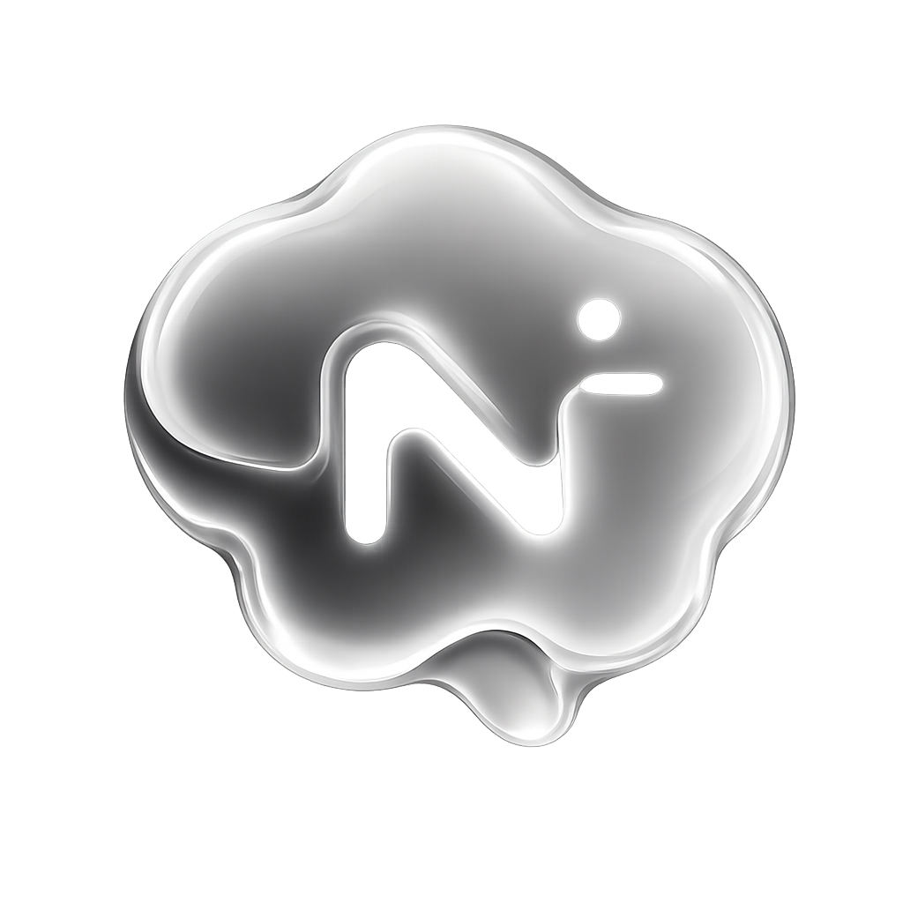
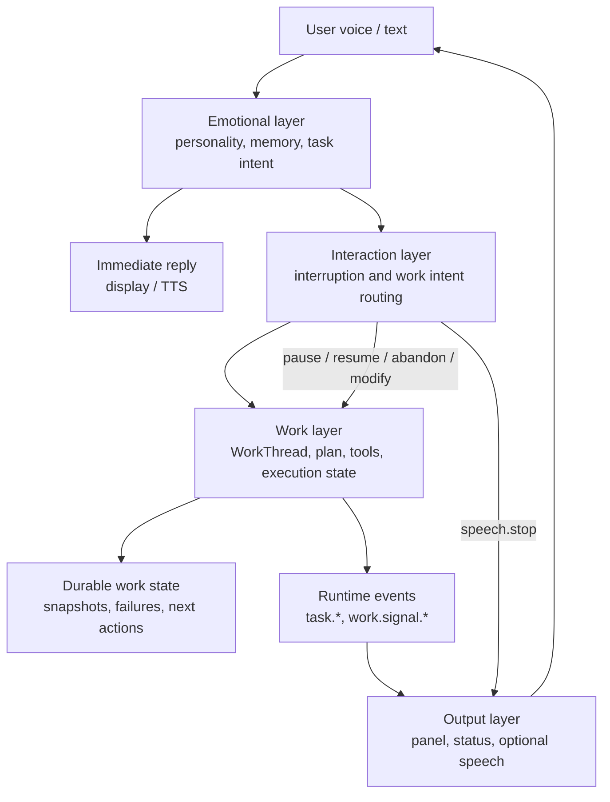

<p align="center">
  
</p>

<p align="center">
  <strong>Putting a living soul into the desktop.</strong>
</p>

<p align="center">
  Voice, memory, emotion, personality, and tools —
  an experiment toward AI that can talk, accompany, and act beside us.
</p>


<p align="center">
  <a href="#features">Features</a>
  ·
  <a href="#architecture">Architecture</a>
  ·
  <a href="#quick-start">Quick Start</a>
  ·
  <a href="#development">Development</a>
  ·
  <a href="#plugins">Plugins</a>
</p>

---

Noema is a small experiment toward something like JARVIS: a desktop companion
that can speak with personality, remember context, understand tasks, and act
through tools.

The project is built around a three-layer runtime split:

- **Emotional layer**: speaks naturally, applies personality and memory, and detects task intent.
- **Work layer**: owns durable task state, plans steps, calls tools, tracks execution state, and records recoverable progress.
- **Interaction layer**: routes user interruptions, task starts, resumes, pauses, and status requests between the emotional and work layers.
- **Output layer**: speaks or displays selected runtime signals without inventing task facts.
- **Voice pipeline**: streams ASR, VAD, turn detection, TTS, interruption, and playback frames.
- **Plugin system**: adds tools, prompt extensions, task context, text transforms, expressions, and admin actions.

## Features

- **Voice-first desktop conversation** with streaming ASR, VAD, smart turn detection, and Fish Audio TTS.
- **Personality-aware replies** driven by role YAML files and conversation memory.
- **Task execution runtime** with planning, tool calls, execution state, compaction, and task admission.
- **Interruption-aware audio path** that can stop speech output without necessarily cancelling active tasks.
- **Persistent memory** backed by SQLite for conversation turns, summaries, user profile, and task runs.
- **Extensible plugin system** for adding new runtime capabilities without changing the core.

## Architecture



Task execution is intentionally asynchronous from the dialogue turn. The
emotional layer can answer immediately, while the work layer continues through
runtime jobs and emits structured events. Speech interruption stops playback; it
does not automatically cancel an active task. Desktop task status, plans, and
step changes are driven by runtime events and work signals, with durable
`WorkThread` state available for pause, resume, abandon, focus, and recovery.

## Quick Start

### Prerequisites

- Node.js 18+
- pnpm 8+
- macOS, Windows, or Linux with microphone access

### Install

```bash
pnpm install
```

The postinstall step attempts to download local ONNX models used by VAD and
smart turn detection. You can run it manually:

```bash
pnpm download:models
```

### Run the desktop app

```bash
pnpm desktop:dev
```

For a production-style local launch:

```bash
pnpm start
```

## Configuration

Most runtime configuration can be edited from the desktop app's settings panel:

- Dialogue model
- Task model
- ASR model
- TTS model
- Proxy
- Voice input/output
- Task runtime limits
- Plugins
- Personality profile

The desktop main process also loads `.env` files from common project locations,
including `apps/desktop/.env` and the repository root. Settings in the app are
the preferred path for day-to-day development because they persist model and
provider choices.

### API Configuration

Noema uses OpenAI-compatible chat endpoints for the dialogue and task models.
Voice input and output are configured separately through ASR and TTS providers.

The recommended setup is to open the desktop app and fill these fields in
**Settings > System**:

- **Dialogue model**: API key, model name, and base URL for normal conversation.
- **Task model**: API key, model name, base URL, and transport for tool/task execution.
- **ASR model**: provider, API key, model name, base URL, and language.
- **TTS model**: provider, API key, model name, voice ID, base URL, and language.
- **Proxy**: optional HTTP(S) proxy used by provider requests.

You can also seed the same settings with a `.env` file:

```bash
# Dialogue model, OpenAI-compatible
LLM_1_API_KEY=your_dialogue_api_key
LLM_1_MODEL=deepseek-chat
LLM_1_BASE_URL=https://api.deepseek.com

# Task model, OpenAI-compatible
TASK_1_API_KEY=your_task_api_key
TASK_1_MODEL=gemini-3.1-pro-preview
TASK_1_BASE_URL=https://generativelanguage.googleapis.com/v1beta/openai

# Text-to-speech
TTS_1_PROVIDER=fish
TTS_1_API_KEY=your_tts_api_key
TTS_1_MODEL=s2-pro
TTS_1_VOICE_ID=your_voice_id

# Speech-to-text
ASR_1_PROVIDER=qwen
ASR_1_API_KEY=your_asr_api_key
ASR_1_MODEL=qwen3-asr-flash-realtime
ASR_1_LANGUAGE=zh

# Optional
PROXY_URL=http://127.0.0.1:7890
```

Provider defaults:

| Area | Supported providers | Default model |
| --- | --- | --- |
| Dialogue / task LLM | OpenAI-compatible endpoint | user configured |
| TTS | `fish`, `openai`, `elevenlabs` | `s2-pro` for Fish Audio |
| ASR | `qwen`, `openai`, `groq` | `qwen3-asr-flash-realtime` |

The indexed variables support multiple saved profiles from `1` to `10`, for
example `LLM_2_API_KEY` or `TTS_2_PROVIDER`. Select the active profile with
`LLM_ACTIVE`, `TASK_ACTIVE`, `TTS_ACTIVE`, and `ASR_ACTIVE`.

## Development

Build the main packages:

```bash
pnpm --filter @noema/sdk build
pnpm --filter @noema/desktop build
```

Run all workspace builds through Turbo:

```bash
pnpm build
```

Start the Electron development app:

```bash
pnpm desktop:dev
```

Clear local conversation and task history:

```bash
pnpm history:clear
```

For changed runtime plugin files, run syntax checks when practical:

```bash
node --check plugins/<plugin-id>/index.mjs
```

## Plugins

Noema loads runtime plugins from `plugins/*/plugin.json`. Plugins can register
tools, extend prompts, inject task context, transform text, select expression
assets, and expose admin actions.

| Plugin | Purpose |
| --- | --- |
| `base-tools` | File reads/writes, search, patching, shell commands, interactive command sessions |
| `browser-use` | Electron browser automation, DOM/AX snapshots, screenshots, file upload, page actions |
| `computer-use` | Native desktop observation and mouse/keyboard control |
| `skills-manager` | Local skill discovery, reading, and management |
| `mcp-manager` | MCP server management and remote tool dispatch |
| `sticker-expression` | Emotion-based sticker selection for replies |
| `fish-s2-emotion` | Fish Audio S2 voice cue prompt additions and TTS text filtering |

Plugin manifests declare permissions, config fields, default enablement, and
admin actions. Keep plugin hooks generic: tools execute actions, context
providers contribute task context, and UI/admin behavior remains separate from
runtime execution.

## Task Runtime

The task runtime keeps execution explicit:

- The dialogue model decides whether a user request contains a task.
- The task model creates and updates a plan.
- Tools perform external actions.
- Execution state records observations, changed files, failures, pending verification, and active sessions.
- New task requests are admitted as `keep_active`, `queue_new`, or `stop_active_start_new`.

During long-running tasks, Noema can generate natural `task_progress`
feedback through the emotional dialogue layer while leaving task execution to
the task model.

## Voice Runtime

The voice path is frame-based and interruption-aware:

- Renderer captures microphone audio with browser-level echo cancellation,
  noise suppression, and automatic gain control.
- Main process streams audio to ASR and endpointing.
- TTS output is queued through the response frame pipeline.
- Speech output can be interrupted without automatically aborting an active task.

Application-level echo suppression is still evolving. Browser-level AEC is
enabled, but robust filtering of TTS audio leaking back into ASR is an area for
future improvement.

## Acknowledgements

The orb UI in Noema directly references the visual direction and interaction
ideas from these excellent Three.js projects. Thanks to their authors and
communities:

- [r3f-rapier-ball-of-glass](https://github.com/antonbobrov/r3f-rapier-ball-of-glass)
  by Anton Bobrov.
- [Singularity](https://github.com/MisterPrada/singularity) by MisterPrada for
  real-time Three.js scene and orb interaction inspiration.

## License

AGPL-3.0-only. See [LICENSE](./LICENSE).
