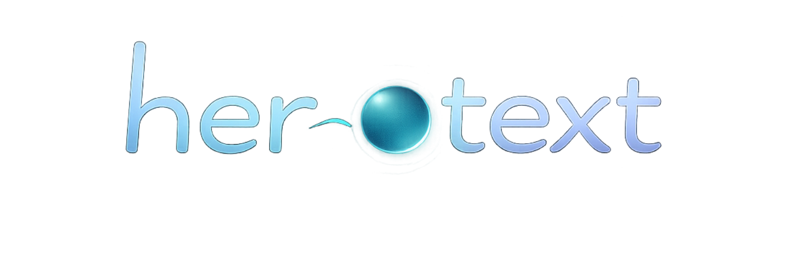

<p align="center">
  
</p>

<p align="center">
  <strong>A desktop agent companion with voice, memory, personality, and runtime tools.</strong>
</p>

<p align="center">
  <a href="#features">Features</a>
  ·
  <a href="#architecture">Architecture</a>
  ·
  <a href="#quick-start">Quick Start</a>
  ·
  <a href="#development">Development</a>
  ·
  <a href="#plugins">Plugins</a>
</p>

---

Her-Text is an experimental desktop AI companion. It combines a conversational
emotional layer with a task runtime, voice input/output, persistent memory,
personality profiles, and pluggable tools for browser, desktop, shell, file, MCP,
and skill-based workflows.

The project is built around a simple split:

- **Dialogue layer**: speaks naturally, applies personality and memory, detects tasks.
- **Task runtime**: plans steps, calls tools, tracks execution state, and handles task admission.
- **Voice pipeline**: streams ASR, VAD, turn detection, TTS, interruption, and playback frames.
- **Plugin system**: adds tools, prompt extensions, task context, text transforms, expressions, and admin actions.

> Her-Text is under active development. APIs, runtime behavior, and plugin
> contracts may still change.

## Features

- **Voice-first desktop conversation** with streaming ASR, VAD, smart turn detection, and Fish Audio TTS.
- **Personality-aware replies** driven by role YAML files and conversation memory.
- **Task execution runtime** with planning, tool calls, execution state, compaction, and task admission.
- **Interruption-aware audio path** that can stop speech output without necessarily cancelling active tasks.
- **Persistent memory** backed by SQLite for conversation turns, summaries, user profile, and task runs.
- **Runtime plugin system** for tools, context injection, prompt additions, expression selection, and admin actions.
- **Browser and computer-use tools** for web automation, screenshots, keyboard/mouse control, and UI observation.
- **Skills and MCP support** through dedicated runtime plugins.

## Architecture

```text
User voice/text
      │
      ▼
Dialogue emotional layer
  - personality
  - memory
  - task detection
      │
      ├── normal reply ───────────────► TTS / display
      │
      ▼
TaskSession / TaskRuntime
  - task admission
  - planning
  - tool loop
  - execution state
  - task progress hooks
      │
      ├── task_progress emotional feedback ─► TTS / display
      │
      ▼
Final task result
      │
      ▼
task_result emotional layer ─────────► TTS / display
```

### Packages

| Path | Role |
| --- | --- |
| `apps/desktop` | Electron desktop app, renderer UI, main-process orchestration, IPC, voice lifecycle |
| `packages/sdk` | Dialogue, task runtime, memory, personality, audio, VAD, tools, plugins |
| `packages/core` | OpenAI-compatible LLM provider and shared core utilities |
| `packages/types` | Shared TypeScript contracts |
| `plugins` | Runtime plugins for tools, browser control, computer use, MCP, skills, expressions, and TTS cues |

## Quick Start

### Prerequisites

- Node.js 18+
- pnpm 8+
- macOS, Windows, or Linux with microphone access

### Install

```bash
pnpm install
```

The postinstall step attempts to download local ONNX models used by VAD and
smart turn detection. You can run it manually:

```bash
pnpm download:models
```

### Run the desktop app

```bash
pnpm desktop:dev
```

For a production-style local launch:

```bash
pnpm start
```

## Configuration

Most runtime configuration can be edited from the desktop app's settings panel:

- Dialogue model
- Task model
- ASR model
- TTS model
- Proxy
- Voice input/output
- Task runtime limits
- Plugins
- Personality profile

The desktop main process also loads `.env` files from common project locations,
including `apps/desktop/.env` and the repository root. Settings in the app are
the preferred path for day-to-day development because they persist model and
provider choices.

## Development

Build the main packages:

```bash
pnpm --filter @her-text/core build
pnpm --filter @her-text/sdk build
pnpm --filter @her-text/desktop build
```

Run all workspace builds through Turbo:

```bash
pnpm build
```

Start the Electron development app:

```bash
pnpm desktop:dev
```

Clear local conversation and task history:

```bash
pnpm history:clear
```

For changed runtime plugin files, run syntax checks when practical:

```bash
node --check plugins/<plugin-id>/index.mjs
```

## Plugins

Her-Text loads runtime plugins from `plugins/*/plugin.json`. Plugins can register
tools, extend prompts, inject task context, transform text, select expression
assets, and expose admin actions.

| Plugin | Purpose |
| --- | --- |
| `base-tools` | File reads/writes, search, patching, shell commands, interactive command sessions |
| `browser-use` | Electron browser automation, DOM/AX snapshots, screenshots, file upload, page actions |
| `computer-use` | Native desktop observation and mouse/keyboard control |
| `skills-manager` | Local skill discovery, reading, and management |
| `mcp-manager` | MCP server management and remote tool dispatch |
| `sticker-expression` | Emotion-based sticker selection for replies |
| `fish-s2-emotion` | Fish Audio S2 voice cue prompt additions and TTS text filtering |

Plugin manifests declare permissions, config fields, default enablement, and
admin actions. Keep plugin hooks generic: tools execute actions, context
providers contribute task context, and UI/admin behavior remains separate from
runtime execution.

## Task Runtime

The task runtime keeps execution explicit:

- The dialogue model decides whether a user request contains a task.
- The task model creates and updates a plan.
- Tools perform external actions.
- Execution state records observations, changed files, failures, pending verification, and active sessions.
- New task requests are admitted as `keep_active`, `queue_new`, or `stop_active_start_new`.

During long-running tasks, Her-Text can generate natural `task_progress`
feedback through the emotional dialogue layer while leaving task execution to
the task model.

## Voice Runtime

The voice path is frame-based and interruption-aware:

- Renderer captures microphone audio with browser-level echo cancellation,
  noise suppression, and automatic gain control.
- Main process streams audio to ASR and endpointing.
- TTS output is queued through the response frame pipeline.
- Speech output can be interrupted without automatically aborting an active task.

Application-level echo suppression is still evolving. Browser-level AEC is
enabled, but robust filtering of TTS audio leaking back into ASR is an area for
future improvement.

## Project Structure

```text
her-text/
├── apps/
│   └── desktop/          # Electron desktop app
├── packages/
│   ├── core/             # LLM provider and core utilities
│   ├── sdk/              # Dialogue, task, audio, memory, plugins
│   └── types/            # Shared TypeScript types
├── plugins/              # Runtime SDK plugins
├── role/                 # Personality profiles
├── models/               # Local ONNX model files
├── scripts/              # Maintenance and model download scripts
└── assets/               # README and project visual assets
```

## Status

Her-Text is currently a private, fast-moving desktop agent experiment. The core
runtime is usable, but the project still prioritizes iteration over API
stability.

## License

MIT
