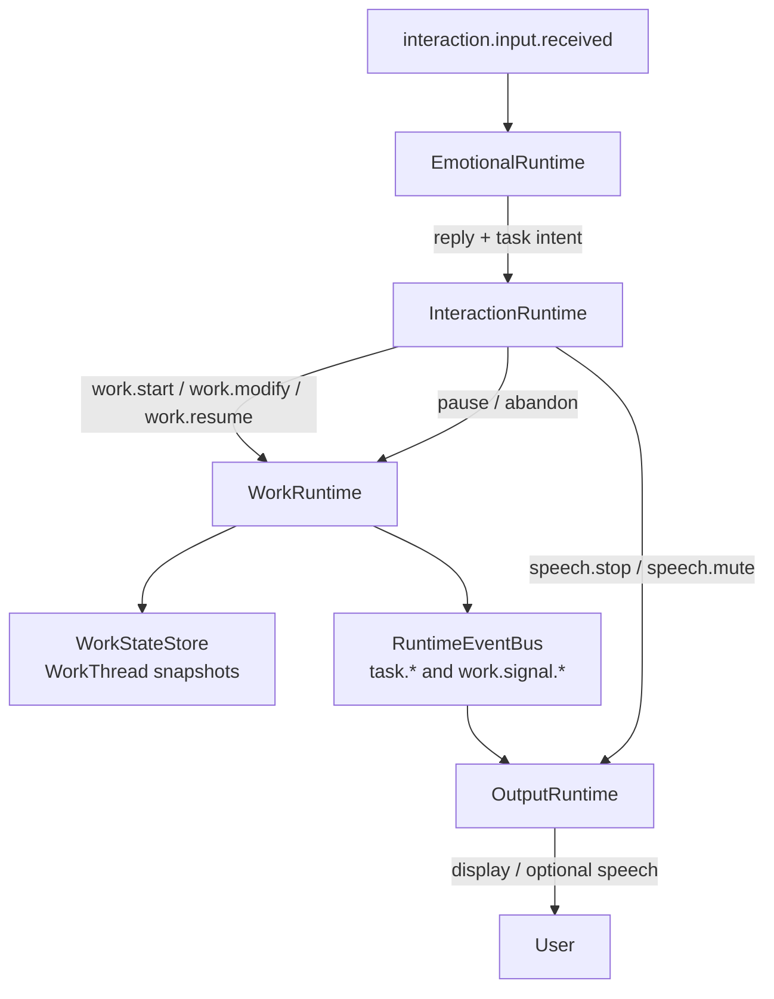

# Three-Layer Runtime Architecture

This document freezes the first boundary for the next task runtime architecture.
The goal is to separate emotional expression, durable work execution, and the
interaction policy between them.

## Layers

### EmotionalRuntime

Owns relationship-aware language and presentation intent.

Inputs:

- User text or transcribed speech.
- Conversation context, memory, and personality.
- Work facts and work signals selected by the interaction layer.

Outputs:

- Visible reply text.
- Emotion tag.
- Intent hints.
- Emotional turn record for the work layer.

Must not:

- Decide that a task is complete without a work event.
- Invent tool results, files changed, command output, or verification status.
- Own task cancellation, pause, resume, rollback, or abandonment.
- Block on long-running work before producing ordinary conversational output.

Current preservation rule:

- The existing TTS frame path stays intact. `ResponseFramePipeline`, provider
  selection, Fish S2 text transforms, display transforms, and expression hooks
  may consume new events later, but they are not replaced by this migration.

### WorkRuntime

Owns durable work state and problem solving.

Inputs:

- User input.
- Emotional turn records.
- Interaction intents.
- Tool results and observations.
- Persisted work snapshots from previous turns or app launches.

Outputs:

- Work state snapshots.
- Work signals for the interaction layer.
- Task/tool/turn execution events.
- Artifacts, decisions, failures, and next actions.

Must not:

- Speak directly to the user.
- Choose final wording, voice style, or expression assets.
- Treat speech interruption as task cancellation unless the interaction layer
  sends an explicit work cancellation intent.

### InteractionRuntime

Owns routing and timing between emotional conversation and durable work.

Inputs:

- User input.
- Emotional layer input and output.
- Current output state.
- Current work state.
- Recent interruption and focus history.

Outputs:

- Speech intents such as stop, mute, unmute, or repeat.
- Work intents such as start, pause, resume, modify, status, cancel, queue, or
  parallel start.
- Feedback decisions that say whether a work signal should be silent, displayed,
  spoken later, spoken now, or interrupt current output.

Must not:

- Execute tools.
- Store source-of-truth task facts.
- Generate user-facing prose beyond short deterministic status labels.

### OutputRuntime

Owns display, TTS, expression, and playback state.

Inputs:

- Emotional output events.
- Feedback decisions.
- Speech/output control intents.

Outputs:

- Display frames.
- TTS frames.
- Expression frames.
- Playback state events.

Must not:

- Cancel, pause, or abandon work by itself.
- Rewrite work facts.

## Event Flow



Current implementation note: dialogue turns do not synchronously wait for the
task result before completing. `DialogueOrchestrator` launches work through the
runtime job path, records an accepted-work marker in context, and lets
`WorkRuntime`/`TaskSession` emit durable task events and work signals. Desktop
status, plans, steps, and completion are driven from those runtime events rather
than direct task lifecycle callbacks.

### Normal Task Start

```text
interaction.input.received
  -> EmotionalRuntime reply + intent hints
  -> InteractionRuntime resolves work.start
  -> WorkRuntime creates/updates WorkThread
  -> WorkRuntime emits work/task events
  -> InteractionRuntime selects important work signals
  -> EmotionalRuntime turns facts into natural feedback
  -> OutputRuntime displays/speaks feedback
```

### User Stops Speech

```text
interaction.input.received
  -> InteractionRuntime resolves speech.stop
  -> OutputRuntime stops playback
  -> WorkRuntime keeps running
  -> WorkState remains unchanged except for interaction history
```

### User Changes Focus

```text
interaction.input.received
  -> EmotionalRuntime responds naturally
  -> InteractionRuntime resolves work.pause + work.queue_new
  -> WorkRuntime snapshots paused thread
  -> WorkRuntime starts or focuses another thread
```

### User Resumes Previous Work

```text
interaction.input.received
  -> InteractionRuntime resolves work.resume
  -> WorkRuntime loads WorkThread snapshot
  -> WorkRuntime continues from nextActions/currentStep
```

## Her-Text Interaction Differences

The reference CLI model is a strong execution target, but Her-Text has a
different interruption surface. The copied execution strength must be adapted
through policy instead of inherited blindly.

- A new CLI-style user turn often replaces or interrupts the current operation.
- A new Her-Text voice input is first an interaction event and must not cancel
  work unless it resolves to an explicit work cancellation intent.
- The reference runtime is primarily repository-oriented.
- Her-Text must also coordinate desktop, browser, voice, Live2D expression,
  long-term companionship, and background work.

Default input policy:

- Text input routes to the focused work thread unless the interaction layer
  identifies a new-task or cancellation intent.
- Voice input preserves active work by default and may only stop output.
- Manual TTS stop controls playback only.
- App close snapshots recoverable work.
- System sleep pauses active work with a snapshot.
- System resume prefers recoverable paused or failed work.

Work focus policy:

- Foreground thread receives durable user input first.
- Paused threads are recoverable and can be resumed from snapshot facts.
- Background threads may continue commands or long runs without owning speech.
- Abandoned threads stay queryable as history but do not receive default focus.

Feedback policy:

- The work layer emits facts, risks, blockers, and completion signals.
- The interaction layer chooses timing and whether the emotional layer should
  ask the user.
- The emotional layer owns wording and voice, but not work facts.

## Naming Rules

Implementation names must be Her-Text native. New file names, directory names,
module names, type names, event names, tool names, and public APIs must not
contain the borrowed project name used by the reference implementation.

Recommended names:

- `WorkSession`
- `WorkTask`
- `WorkTurn`
- `WorkThread`
- `WorkState`
- `ToolRouter`
- `ToolOrchestrator`
- `InteractionRuntime`
- `EmotionalRuntime`
- `LongRunRuntime`

Forbidden examples:

- Reference-project-prefixed session/task/turn/router names.
- Reference-project-named events.
- Reference-project-named tools or public exports.

## Migration Boundary

The old `DialogueOrchestrator` currently owns too much:

- emotional reply generation,
- task admission,
- task execution launch,
- progress feedback scheduling,
- task result wording.

Migration order:

1. Introduce shared event and state types.
2. Persist work snapshots while the old task loop still runs.
3. Route user interruption semantics through `InteractionRuntime`.
4. Move task execution into `WorkRuntime`.
5. Keep emotional output and TTS behavior stable while execution moves.
